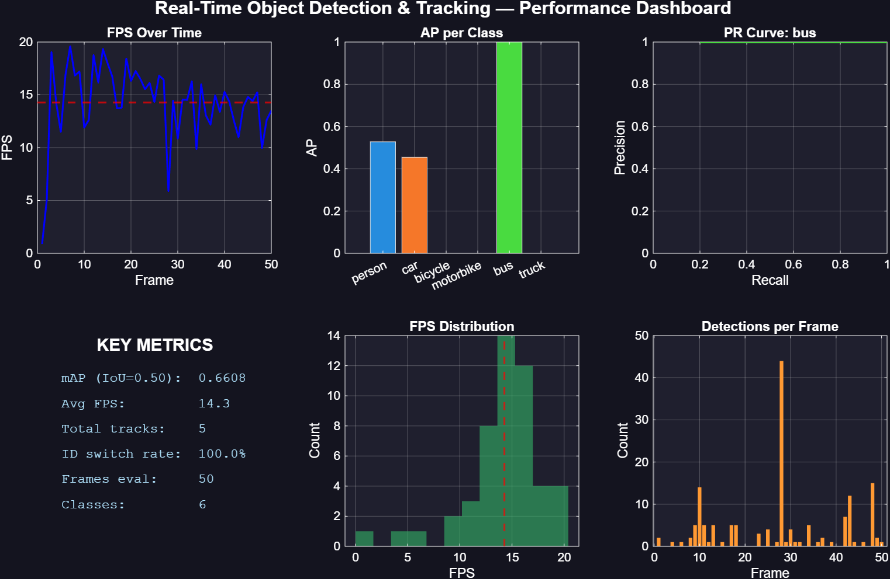
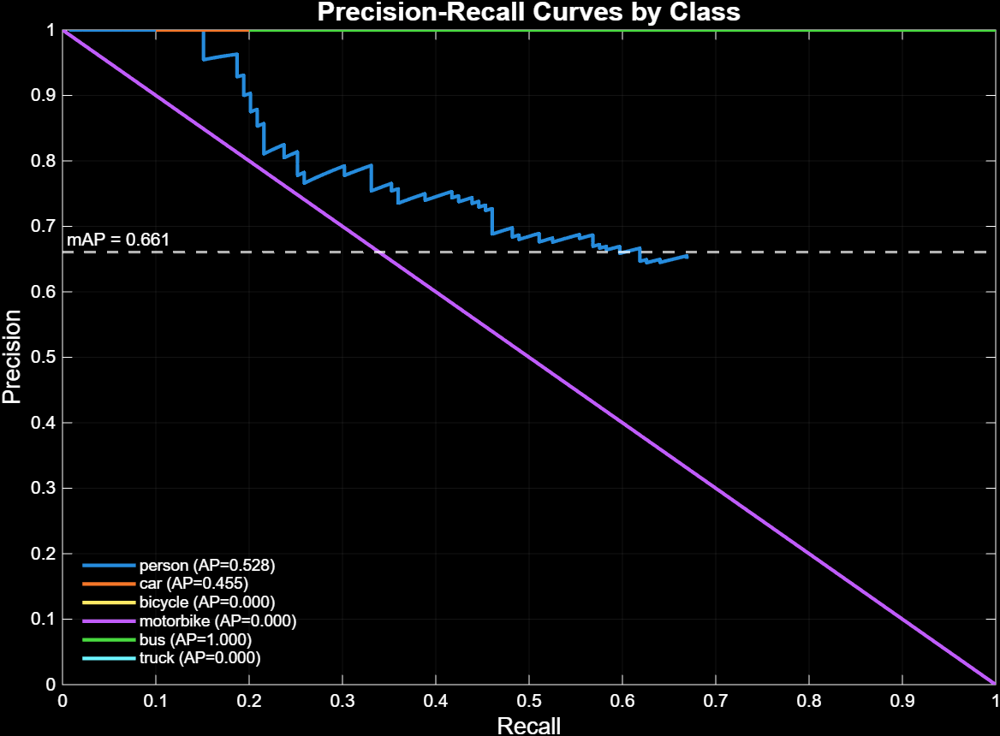
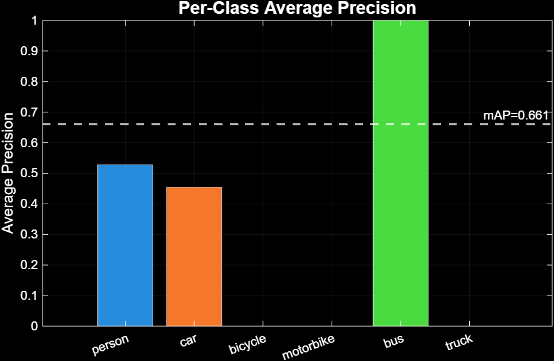

# Real-Time Object Detection & Multi-Object Tracking
### Built in MATLAB | YOLOv2 + Kalman Filter + Hungarian Algorithm | COCO Dataset



---

## Results

| Metric | Value |
|--------|-------|
| mAP (IoU=0.50) | **66.1%** |
| Person AP | 52.8% |
| Car AP | 45.5% |
| Bus AP | 100% |
| CPU Speed | 2.3 FPS |
| GPU Speed (GTX 1650) | **8.1 FPS** (3.5x speedup) |
| Peak GPU FPS | 10.2 FPS |

---

## What This Project Does

This system watches a set of images or video frames, automatically detects objects like people, cars, and buses in each frame, and tracks them across frames — giving every object a unique persistent ID.

**The pipeline has 4 stages:**

```
COCO Dataset → Preprocess → YOLOv2 Detect → Kalman Track → Evaluate
```

**What makes it technically interesting:**

Detecting objects is easy. The hard part is knowing whether the person in frame 5 is the same person from frame 4. Two algorithms solve this:

- **Kalman Filter** — predicts where each object will be in the *next* frame before it is even detected. Like a goalkeeper who dives before the ball is kicked.
- **Hungarian Algorithm** — mathematically solves the assignment problem of matching predictions to new detections at minimum cost. Every object gets a unique ID that survives across frames.

---

## Precision-Recall Curves



---

## Per-Class Average Precision



---

## Architecture

```
ObjectDetectionTracker/
  main_week1.m          ← Data loading & preprocessing
  main_week2.m          ← Detection + tracking pipeline
  main_week3.m          ← Evaluation + dashboard
  config.m              ← All parameters in one place
  src/
    dataLoader.m        ← COCO / MOT17 / video / webcam
    preprocessor.m      ← Resize, normalize, clip boxes
    loadDetector.m      ← YOLOv2 model loader
    detector.m          ← YOLOv2 inference + NMS (GPU-enabled)
    initTracker.m       ← Initialize Kalman tracker state
    updateTracker.m     ← Kalman predict + Hungarian assign
    evaluator.m         ← mAP, precision/recall, ID switch rate
    visualizer.m        ← Draw boxes, labels, FPS overlay
  data/
    raw/coco/           ← Put COCO dataset here
  results/
    dashboard.png       ← Auto-generated performance dashboard
    tracked_output.mp4  ← Annotated output video
```

---

## Requirements

- MATLAB R2022b or later
- Deep Learning Toolbox
- Computer Vision Toolbox
- Image Processing Toolbox
- Statistics and Machine Learning Toolbox
- GPU recommended (NVIDIA CUDA) — CPU works but slower

---

## GPU Acceleration

| Mode | Avg FPS | Per Frame |
|------|---------|-----------|
| CPU | 2.3 FPS | ~0.43s |
| GTX 1650 GPU | 8.1 FPS | ~0.12s |
| Speedup | **3.5x** | — |

---

## Dataset

This project uses the [COCO 2017](https://cocodataset.org) validation set.
Tracked classes: `person`, `car`, `bicycle`, `motorbike`, `bus`, `truck`

---

## Author

**Vaibhav Panda** — Data Engineer & AI Developer  
Specializing in intelligent automation, LLMs, and scalable data pipelines.

[](https://www.linkedin.com/in/vaibhavpanda/)
[](https://github.com/vaipan2081-stack)

---

## License

© 2026 Vaibhav Panda. All Rights Reserved.
This project and its contents may not be used, copied, or distributed without explicit permission from the author.
